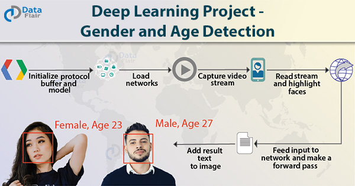
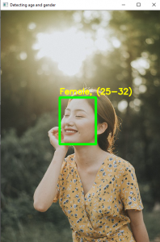
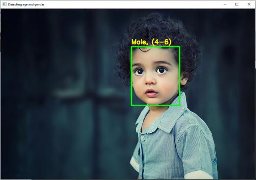
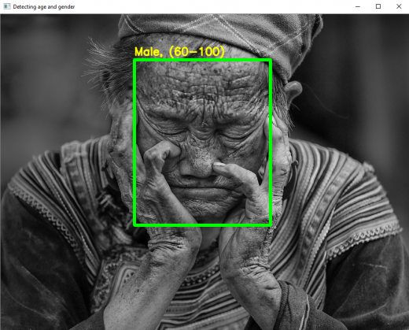
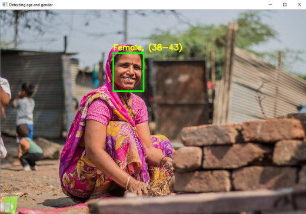
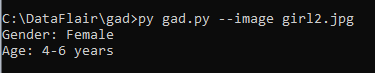
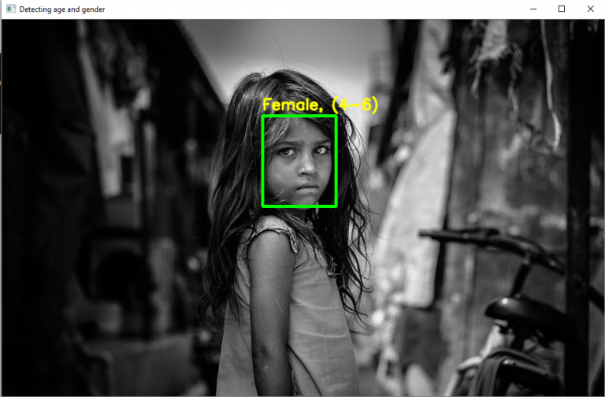

<h1 align="center">Gender and Age Detection</h1>

  
  

## Description
 You might have seen many smartphone cameras are now equipped with AI. They can even predict if a person is a male or female and their age. This can be done with deep learning (CNN).
 The predicted gender may be one of ‘Male’ and ‘Female’, and the predicted age may be one of the following ranges- (0 – 2), (4 – 6), (8 – 12), (15 – 20), (25 – 32), (38 – 43), (48 – 53), (60 – 100) (8 nodes in the final softmax layer). 
 It is very difficult to accurately guess an exact age from a single image because of factors like makeup, lighting, obstructions, and facial expressions. And so, we make this a classification problem instead of making it one of regression.

## Screenshots
 

 
 
 
 

## dataset
For this python project, we’ll use the Adience dataset; the dataset is available in the public domain and you can find it [here](https://www.kaggle.com/ttungl/adience-benchmark-gender-and-age-classification)

